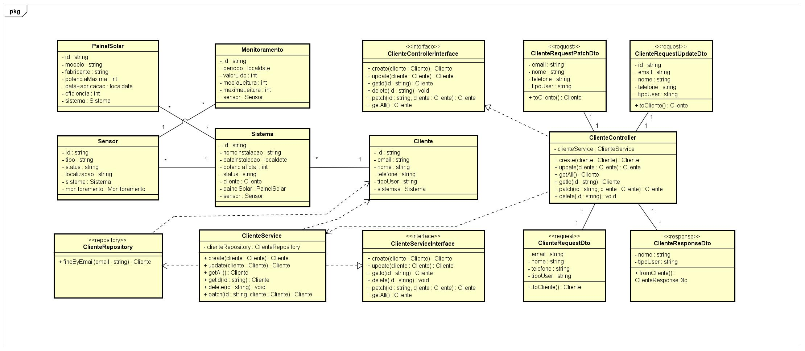
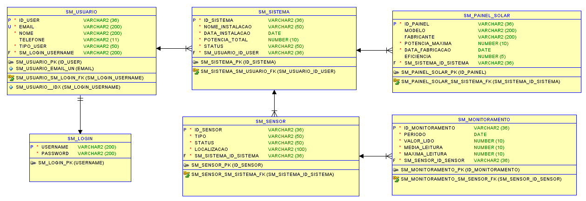

# SolarMetrics - API em Spring Boot

**SolarMetrics** é uma API desenvolvida para monitoramento e análise de energia solar, fornecendo dados em tempo real sobre sensores, usuários e ocupação de sistemas. A aplicação permite integrar sensores IoT, gerar relatórios e fornecer dados para aplicativos móveis ou dashboards web.

## Sobre o time

- **Arthur Algate RM:560109**: Responsável pelo banco de dados e Compliance QA.  
- **Carlos Clementino RM:561187**: Responsável pelo desenvolvimento da API em Java Spring Boot e .NET, infraestrutura e práticas de DevOps, e pela integração com dispositivos IoT.  
- **Eder Silva RM:559647**: Responsável pela criação do APP mobile.

## Como rodar a aplicação

### Pré-requisitos
- Java 17 ou superior  
- Maven 3.8+  
- IDE recomendada: IntelliJ IDEA ou VSCode  

### Perfis de execução
A aplicação possui dois **profiles** de configuração de banco de dados:

1. **local**: utiliza o banco em memória H2, ideal para testes e desenvolvimento local.  
2. **prod**: conecta com o Oracle Database, utilizado para produção.

### Passos para executar

1. Clone o repositório:  
```bash
git clone https://github.com/ARC-ceo/SolarMetrics-JavaAdvanced.git
```

2. Execute a aplicação com o profile desejado:

**Para local (H2):**
```bash
mvn spring-boot:run -Dspring-boot.run.profiles=local
```

**Para produção (Oracle):**
```bash
mvn spring-boot:run -Dspring-boot.run.profiles=prod
```

3. A API estará disponível em: `http://localhost:8080`

### Testando a API
A documentação dos endpoints está disponível via **Swagger UI**:  
`http://localhost:8080/swagger-ui/index.html`

## Diagramas

### Diagrama de Classes


### Modelo Físico


## Apresentação
Assista ao vídeo explicando a proposta tecnológica, o público-alvo e os problemas que a aplicação resolve:  
[Apresentação SolarMetrics](https://youtu.be/Fcza8JBvsyw)

## Video demonstrativo
Assista ao vídeo para a demonstração e teste da API na prática:  
[Apresentação SolarMetrics](https://www.youtube.com/seu_link_aqui)

## Endpoints da API

A API foi documentada com **Swagger / OpenAPI**, oferecendo exemplos completos de requisição e resposta.  

### Endpoints principais

| Método | Endpoint                  | Descrição                                   |
|--------|---------------------------|--------------------------------------------|
| GET    | /cliente             | Listar todos clientes cadastrados        |
| PUT    | /cliente        | Atualizar cadastro do cliente |
| POST   | /cliente            | Criar cadastro do cliente                     |
| GET    | /cliente/{id}        | Buscar cadastro do cliente                 |
| DELETE | /cliente/{id}        | Deletar cadastro do cliente                             |
| PATCH    | /cliente/{id}              | Atualiza o campo desejado do cliente          |

> Para todos os endpoints, exemplos detalhados de request e response estão disponíveis no **Swagger UI**.

## Tecnologias utilizadas
- Java 17  
- Spring Boot 3.x  
- Spring Data JPA  
- Hibernate  
- H2 Database (local)  
- Oracle Database (prod)  
- Swagger / OpenAPI  

---

**SolarMetrics** — Sua energia. Seu controle  ☀️
